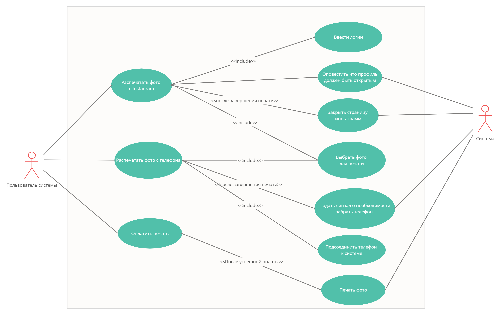

# Итоговая работа

### Контекст: вы — аналитик команды, которая разрабатывает программное обеспечение для автомата, печатающего фото из Instagram.

На встрече с представителем заказчика выяснили, что автомат должен работать следующим образом:

- При нажатии на кнопку «Выбрать фото для печати» на главном экране пользователю предложены 2 способа — выбрать фото в Instagram или загрузить фото с телефона.
- Для выбора фото из Instagram пользователю необходимо указать свой логин. Профиль пользователя должен быть открытым.
- Для выбора фото с телефона, пользователю нужно соединить телефон с автоматом для печати фото через кабель для зарядки.
- Пользователь может выбрать количество фотографий для печати через экран автомата. Минимальное количество фото — 1, максимальное —100 (если в автомате достаточно бумаги).
- Оплатить печать фото можно только по карте через физический терминал бесконтактной оплаты.
- Печать фото запускается после успешной оплаты выбранного пакета фотографий.
- Если пользователь вводил логин Instagram для печати фотографий, то после завершения печати его страница в автомате должна быть закрыта.
- Если пользователь присоединял телефон для печати фотографий, то после завершения печати автомат будет сигнализировать о необходимости забрать телефон.

#### Задание:

Напишите минимум 5 формализованных требований к разрабатываемому программному обеспечению (желательно разных типов, но на ваше усмотрение).

Подготовьте диаграмму вариантов использования, покрывающую описанные в контексте действия.

Подготовьте текстовое описание любого варианта использования из получившейся на шаге 2 диаграммы.

(не обязательно) подумайте и опишите словами, обработку каких системных ошибок нужно учесть при реализации программного обеспечения.

## Выполненная работа

### Автомат печатающий фотографии из Instagram

Формализованные требования

- ФТ001. Система “Автомат с печатью” должна иметь возможность производить печать фото как и с Instagram-аккаунта, так и с фотопленки телефона.
- ФТ002. Система “Автомат с печатью” должна иметь возможность найти страницу Instagram-пользователя, после ввода его логина.
- ПТ001. Пользователь должен иметь возможность присоединиться к системе “Автомат с печатью”, через кабель для зарядки. 
- ПТ002. Пользователь должен иметь возможность выбрать количество фотографий для печати через экран системы “Автомат с печатью”.
- О001. Система “Автомат с печатью” должна иметь возможность производить оплату, только путем бесконтактной оплаты через физический терминал.
- АК001. При поиске Instagram-аккаунта, время загрузки фотографий не должно превышать свыше 30 секунд. 

Диаграмма ВИ прикреплена фотографией.

 
### Текстовое описание ВИ

**UC-VF-1** Выбрать фото для печати

**Краткое описание:** Потенциальный клиент выбирает фотографию, которую он хочет распечатать в автомате.

**Действующие лица:** Клиент

**Триггер:** Клиент нажимает кнопку “выбрать фото для печати”. 

**Предусловия:** Клиент пользователь инстаграм. Клиент имеет зарядное устройство и телефон.

1) Покупатель выбирает способ печати фотографий.
2) Система предлагает клиенту выбрать фото в инстаграмм.
3) Если клиент является пользователем инстаграма, то система переходит на следующий шаг.
4) Клиент выбирает количество фотографий для печати.
5) Если клиент указал менее 100 фотографий для печати, то система переходит на следующий шаг.
6) Клиент подтверждает печать выбранных им фотографий.
7) Вариант использования завершает свою работу

**Постусловие:** Клиент выбирает фото для печати

**Результат:** В случае успешного выполнения основного потока, клиент выбирает фото для печати. 

**Альтернативный поток:**

3а)  Система предлагает подключить телефон через кабель для зарядки, чтобы произвести печать фотографий.
1) Управление переходит на шаг 4

5a)  Система отображает уведомление, о превышении количестве фотографий для печати.
1) Управление переходит на шаг 4
